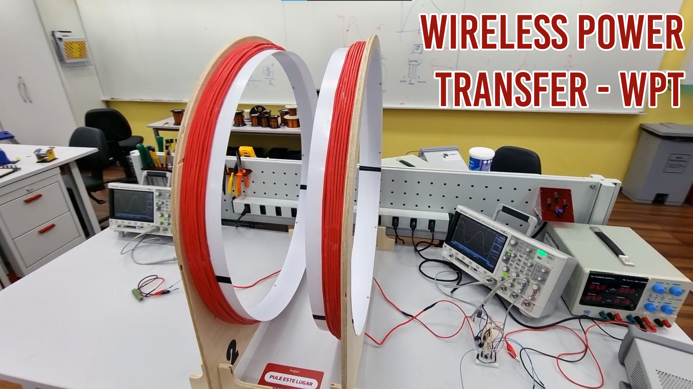

# Modelagem do sistema Wireless Power Transmission - WPT

  

## Alunos

<table>
  <tr>
    <td align="center"><a href="https://github.com/DaviReisVieira"> <b>Davi Reis Vieira</b></a> <a href="https://github.com/DaviReisVieira" title="Davi Reis Vieira">O EaD</a></td>
    <td align="center"><a href="https://github.com/fran-janela"> <b>Francisco Pinheiro Janela</b></a> <a href="https://github.com/fran-janela" title="Francisco Pinheiro Janela">O Mestre das bobinas</a></td>
    <td align="center"><a href="https://github.com/NicolasQueiroga"> <b>Nicolas Maciel Queiroga</b></a> <a href="https://github.com/NicolasQueiroga" title="Nicolas Maciel Queiroga">O Calculista</a></td>
  </tr>
</table>

